# RF-Pen: Шпионская ручка-шпаргалка с OLED-дисплеем и радиочатом

**RF-Pen** — это хобби-проект, рожденный из идеи создать гаджет в стиле агента-007 для школьных и студенческих нужд. Устройство выполнено в форме толстого фломастера и оснащено OLED-дисплеем, скрытым за выдвижной шторкой, а также радиомодулем для обмена сообщениями.

Это демонстрация полного цикла разработки встраиваемой системы: от первоначальной идеи, 3D-моделирования корпуса и проектирования печатной платы до написания низкоуровневой прошивки, кастомного ПО для ПК и сборки полностью функционального прототипа.

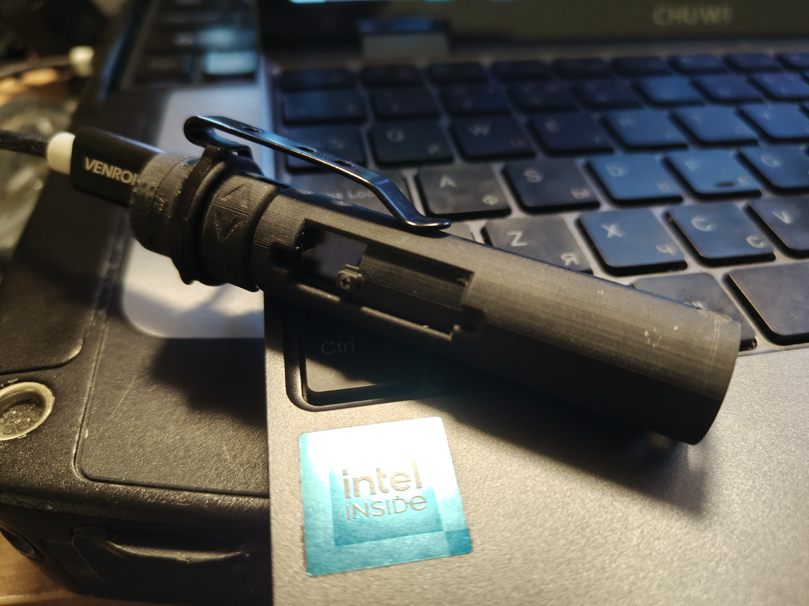
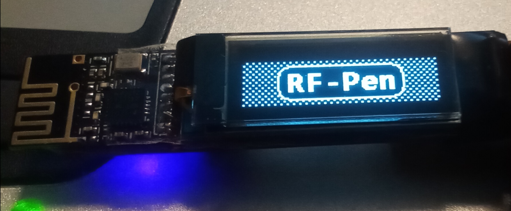

## 🚀 Ключевые особенности

*   **OLED-дисплей:** Монохромный дисплей 128x32 для отображения текста, иконок и кастомных изображений.
*   **Радиочат в реальном времени:** Главная "фишка" проекта. Два устройства могут обмениваться текстовыми сообщениями на расстоянии до 10 метров, даже находясь на разных этажах.
*   **Встроенная память:** Внешняя EEPROM-память на 64КБ для хранения текста, настроек и приложений.
*   **Связь с ПК:** Устройство подключается по USB и определяется как COM-порт. Специальная утилита для Windows позволяет загружать текст ("шпаргалки"), изображения, шрифты и обновлять прошивку.
*   **Мини-ОС:** Простая операционная система с набором приложений:
    *   **Читалка:** для просмотра загруженного текста и изображений.
    *   **Заметки:** создание и редактирование текста прямо на устройстве.
    *   **Калькулятор:** для простых вычислений.
    *   **Таймер:** со звуковым (вибро) сигналом.
    *   **Датчик:** отображение температуры и влажности с сенсора AHT20.
*   **Полная кастомизация:** Шрифты, логотип, иконки и все строки интерфейса нарисованы вручную и компилируются в прошивку с помощью собственного набора утилит.

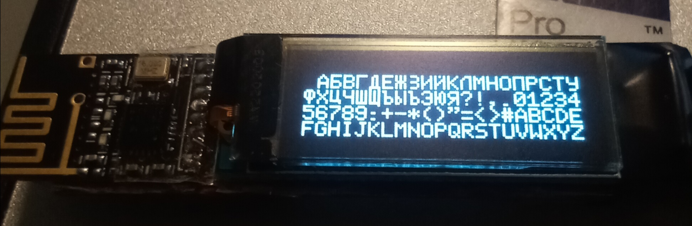
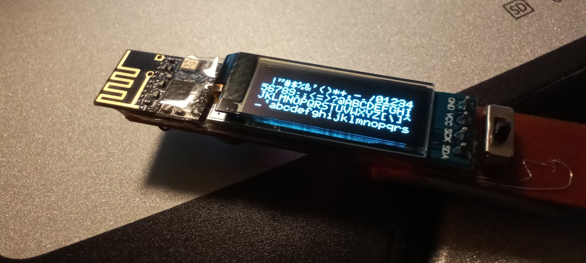

## 🛠️ Технические характеристики

*   **Микроконтроллер:** STMicroelectronics `STM8S003F3P6`.
*   **Радиомодуль:** `NRF24L01+` (2.4 ГГц).
*   **Дисплей:** 0.91" OLED 128x32 на драйвере `SSD1306` (I2C).
*   **Память:** Внешняя EEPROM `BL24C512A` (64 КБ) по I2C.
*   **Датчик:** `AHT20` (температура и влажность).
*   **Интерфейс с ПК:** `CH330N` (USB-to-UART).
*   **Питание:** Li-Po аккумулятор 3.7В, 100 мАч.
*   **Зарядка:** Через Micro-USB, контроллер `MCP73831T-2ATI/OT`.
*   **Стабилизатор:** `HT7533-7` (3.3В LDO).
*   **Корпус:** Разработан в КОМПАС-3D, напечатан на SLA 3D-принтере.

## ⚙️ Процесс разработки: от идеи до прототипа

Этот проект — результат глубокого погружения в каждый аспект приборостроения.

### 1. Проектирование электроники

Схема и двухслойная печатная плата были разработаны в **EasyEDA**. Ключевой задачей было разместить все компоненты на узкой плате, чтобы она поместилась в корпус, сопоставимый по размерам с фломастером.

Первая версия платы (прототип) была изготовлена в домашних условиях на мини-ЧПУ станке для экономии времени. Это был настоящий вызов — фрезеровка дорожек и последующая пайка SMD компонентов на голую медь без маски и шелкографии.

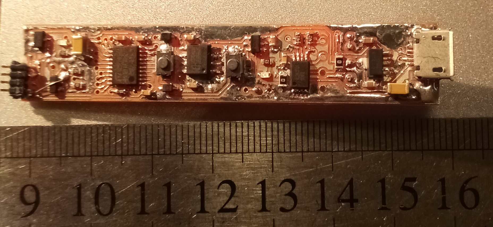
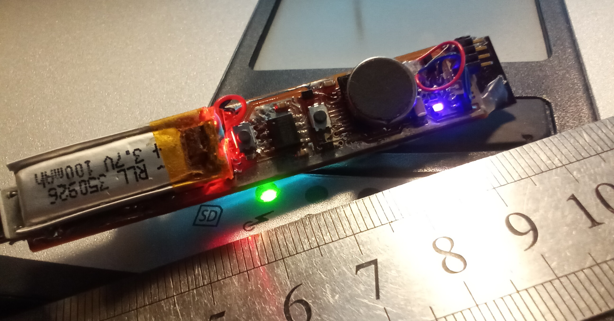

**Электрическая схема:**

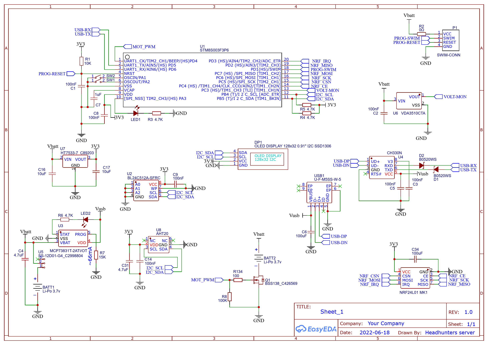

**Топология печатной платы:**

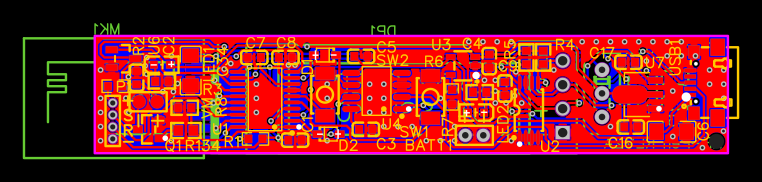

### 2. Сборка и пайка

Все прототипы собирались и паялись вручную с использованием термофена и паяльника. Плотность компоновки и использование мелких SMD-компонентов требовали высокой точности.

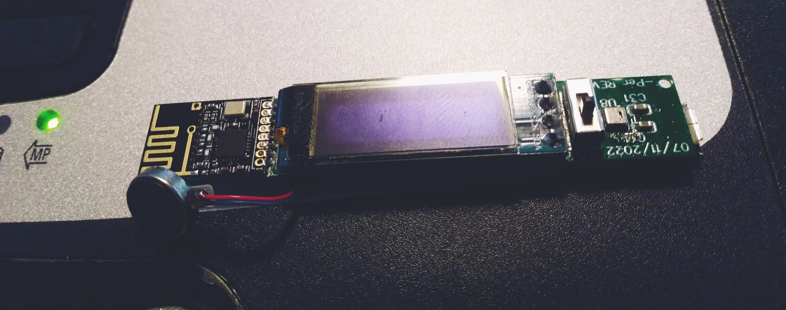
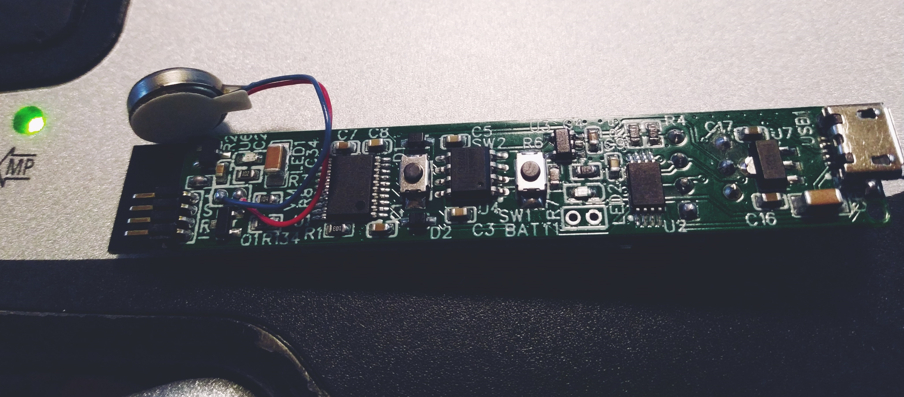

### 3. Разработка корпуса

Корпус был спроектирован в **КОМПАС-3D** и напечатан на домашнем SLA 3D-принтере, что позволило добиться высокой детализации и гладкой поверхности. Конструкция включает две кнопки управления и шторку, которая скрывает дисплей, придавая устройству вид обычного маркера.

### 4. Программное обеспечение

**Прошивка**
*   Написана на **чистом C** программирования в среде **ST Visual Develop (STVD)** с использованием стандартных библиотек периферии STM8.
*   **Собственные драйверы:** Разработаны драйверы для всей периферии с нуля, включая I2C (программный), SPI (программный), UART, а также для OLED-дисплея, радиомодуля NRF24L01 и сенсора AHT20.
*   **Мини-ОС:** Реализован конечный автомат, управляющий экранами, приложениями, пользовательским вводом и системными событиями (например, переход в спящий режим).
*   **Рендеринг графики:** Написаны функции для вывода текста и изображений на OLED-дисплей с использованием кастомного монохромного шрифта размером 6x8 пикселей.

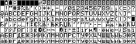

**Утилиты для ПК**
*   Для подготовки данных (шрифты, изображения, текст) и их загрузки в устройство был разработан **собственный набор консольных утилит на C (Win32 API)**.
*   `pc-image-decoder.exe`: Конвертирует монохромные BMP-файлы (шрифты, логотип) в бинарный формат для прошивки.
*   `pc-text-converter.exe`: Обрабатывает текстовые файлы, преобразуя их в специальный формат для "читалки", и собирает все бинарные данные (шрифт, лого, строки, текст) в единый файл `eeprom.bin`.
*   `pc_eeprom_loader.exe`: Прошивает сгенерированный `eeprom.bin` в память устройства через USB-соединение.

## 📂 Структура проекта

*   `/src`: Исходный код прошивки для микроконтроллера STM8S003.
    *   `main.c`: Точка входа, главный цикл, инициализация.
    *   `os.c`: Логика "операционной системы", управление экранами и приложениями.
    *   `oled.c`: Драйвер для OLED-дисплея SSD1306.
    *   `nrf24.c`: Драйвер для радиомодуля NRF24L01.
    *   `eeprom.c`: Драйвер для внешней I2C EEPROM.
    *   `button.c`, `vibro.c`, `uart.c`: Драйверы для кнопок, вибромотора и UART.
*   `/pc-toolchain`: Исходный код и исполняемые файлы утилит для ПК.
*   `/img`: Изображения для этого README.
*   `PCB_V2_GERBER.zip`: Gerber-файлы для заказа печатной платы на производстве.

## 📝 История очередного "велосипеда"

Это был полный цикл "глубокого садомазохизма": от фрезеровки прототипа платы на ЧПУ до написания собственного загрузчика и утилит для ПК. Именно такой подход позволил досконально изучить работу каждого компонента системы и получить бесценный опыт в разработке встраиваемых систем.

## License
This project is licensed under the [CC BY-NC-ND 4.0](https://creativecommons.org/licenses/by-nc-nd/4.0/) license.
